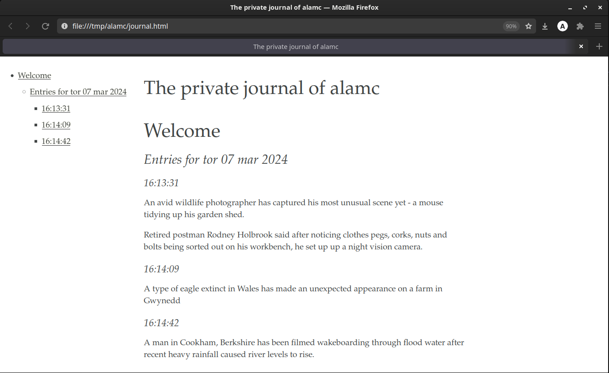

# Mind is a personal journal (diary) application.
Designed for simple and fast entry of spontaneous thoughts, ideas, and reflections. The journal is stored in a plaintext file and can be read in the terminal or in a web browser. The journal is stored in markdown format and will be converted to html on the fly and opened in your default web browser when the `mindreader` program is used.

## Installation
simply run `make install` in the root directory of the project.

## Requirements
- `pandoc` is required to convert the journal to html.
- `xdg-open` is required to open the html file in the default web browser.
- `zenity` is required to prompt the user for the journal entry.

## Usage
Run `mind` in order to add a new entry to the journal. The entry will be saved in ~/.journal and can be read either in the terminal with `less` or by running the companion script `mindreader` which will open convert the journal to a temporary html file and open it in your default web browser.

Run `mind -z` to add a new entry to the journal with a basic gnome prompt (requires zenity).

Both mind and mindreader will be added to your local Desktop application directory.

## Uninstallation
simply run `make uninstall` in the root directory of the project.

## Posible future features
- Add a search feature
- Encrypt the journal
- Add a calendar view
- Improve the data entry with Zenity
- Theme support
- Display newest entries first

## Aknowledgements
CSS from [otsaloma/markdown-css](https://github.com/otsaloma/markdown-css?tab=readme-ov-file) slightly modified to display a table of contents

## License
See [LICENSE](LICENSE) for details.
